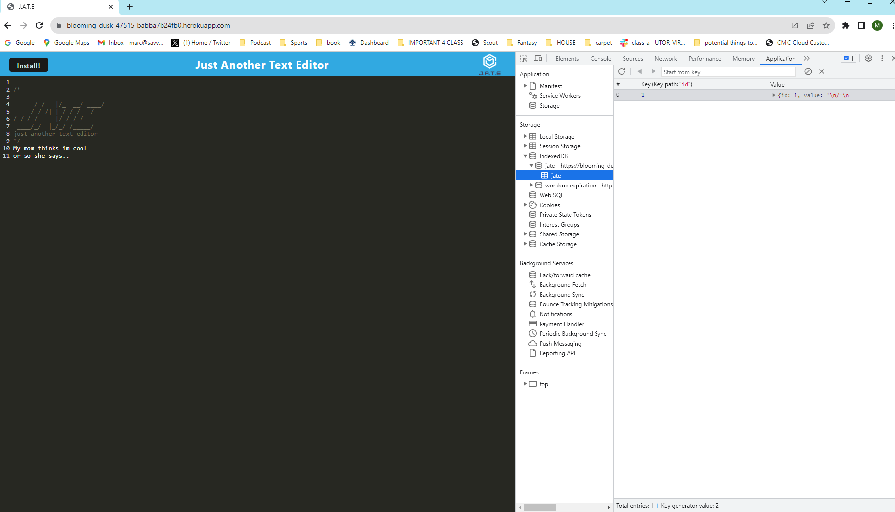
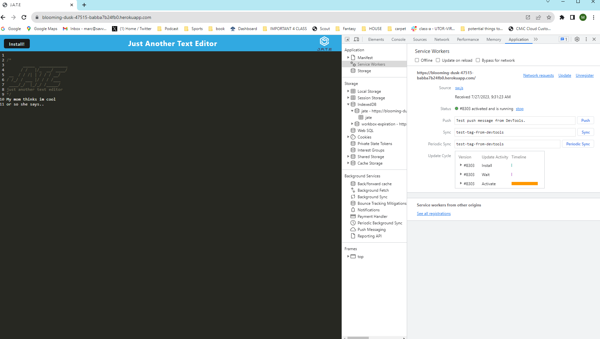
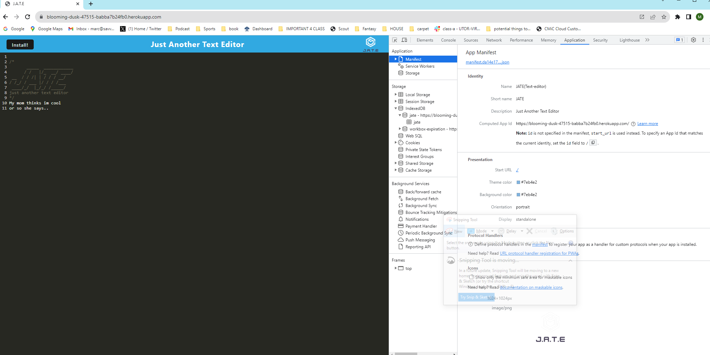

# Progressive Web Application: Text Editor
Text editor that runs in the browser that meets the PWA criteria

## [Table of Contents](#table-of-contents)

- [Description](#description)
- [Final Result](#final-result)
- [Final Result Application](#installation)
- [Deployment](#deployment)
- [Installation](#installation)
- [License](#license)
- [Repo](#Repo)
- [Contributors](#contributors)

## [Description](#table-of-contents)
This app is a single-page application that meets the PWA criteria. Additionally, it will feature a number of data persistence techniques that serve as redundancy in case one of the options is not supported by the browser. The application also functions offline.

The technologies i used are as follows:

- JavaScript
- Node.js
- Express.js
- NPM 
- Nodemon
- Webpack
- Service worker 
- Babel
- Manifest.json
- IndexedDB
- Heroku

## [User Story](#table-of-contents)
AS A developer
I WANT to create notes or code snippets with or without an internet connection
SO THAT I can reliably retrieve them for later use

## [Acceptance Criteria](#table-of-contents)
GIVEN a text editor web application
WHEN I open my application in my editor
THEN I should see a client server folder structure
WHEN I run `npm run start` from the root directory
THEN I find that my application should start up the backend and serve the client
WHEN I run the text editor application from my terminal
THEN I find that my JavaScript files have been bundled using webpack
WHEN I run my webpack plugins
THEN I find that I have a generated HTML file, service worker, and a manifest file
WHEN I use next-gen JavaScript in my application
THEN I find that the text editor still functions in the browser without errors
WHEN I open the text editor
THEN I find that IndexedDB has immediately created a database storage
WHEN I enter content and subsequently click off of the DOM window
THEN I find that the content in the text editor has been saved with IndexedDB
WHEN I reopen the text editor after closing it
THEN I find that the content in the text editor has been retrieved from our IndexedDB
WHEN I click on the Install button
THEN I download my web application as an icon on my desktop
WHEN I load my web application
THEN I should have a registered service worker using workbox
WHEN I register a service worker
THEN I should have my static assets pre cached upon loading along with subsequent pages and static assets
WHEN I deploy to Heroku
THEN I should have proper build scripts for a webpack application

## [Final Result](#table-of-contents)

## [Final Result Application](#table-of-contents)
https://drive.google.com/file/d/1uz0Mv46tdnMV3X0E1J8pM6WsExKDyF3J/view

## [Deployment](#deployment)
[Link to web app](https://blooming-dusk-47515-babba7b24fb0.herokuapp.com/)

## [Installation](#installation)

1. Clone the repository to your local system.
3. Open the repository. 
4. Install the required dependencies from the root directory by running the following command in the terminal:

> npm i && npm run build

5. Start the app by running the following command in your terminal, this command is going to start both the server and the webpack development server concurrently, which will allow you to see the application in your browser: 

> npm run start

6. Once the development server is running, you should be able to access the application by opening your web browser and navigating to the specified URL: http://localhost:3000 .

## [License](#table-of-contents)
MIT

## [Repo](#table-of-contents)
https://github.com/MarcoSaverino/Msavvy-PWA-TextEditor

## [Contributors](#table-of-contents)
Marco Saverino